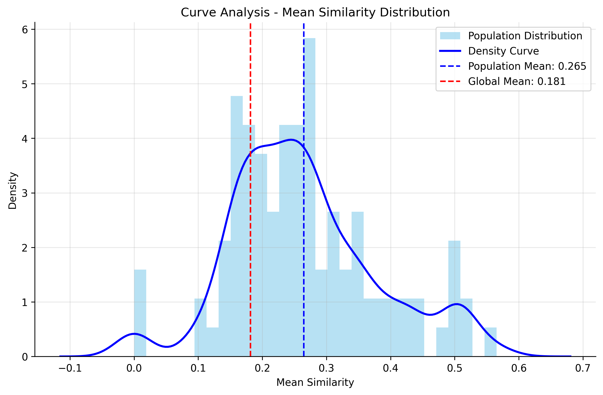
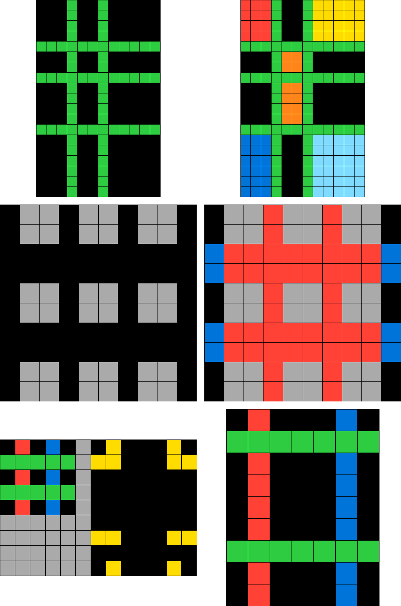

# Classified Intelligence

[Daniel Healy](https://www.linkedin.com/in/daniel-healy/)

## Abstract

Recent work on the ARC-AGI challenge has focused on modifying or using language models, whether via a combination of neural reasoning and symbolic logic [(BARC)](https://github.com/xu3kev/BARC) or a purely neural approach [(MARC).](https://github.com/ekinakyurek/marc)

I opt for an approach that does not use language models, and instead explore the combined embedding and geometric space of ARC grids and grid pairs. I represent program synthesis as a geometric problem within an embedding space, whereby programs are represented as curves, and "writing" a program is accomplished by:

1. finding a nearest-neighbor curve from known sequences, using an example start, end grid pair as input,
2. modifying the known curve to better fit the grid pair,
3. decoding the curve into an ordered list of DSL operations.

I show successful generalization in grid-pair clustering from a constrained set of generated examples to the ARC public dataset.

Notably, each step of the process comes from a sufficiently representative base-level embedding, which subsequent representations depend on to create derivative embedding spaces. By creating a continuous "common language" via embeddings, we address some of [Chollet's original formulations on intelligent systems,](https://arxiv.org/pdf/1911.01547) namely:

1. We can define a gradient of thought from "System 1" to "System 2" in the same embedding space
2. The same general pattern (embed, classify, embed, modify) can be applied efficiently across domains
3. Experience will efficiently expand the intelligence of the system

Consequently, we can standardize the question of building intelligent systems to a more legible engineering challenge, with common libraries and APIs, opening up the possibility of measurable progress both within ARC-AGI and across new domains.

For questions, email daniel.healy05@gmail.com.

## Grids

For background on the ARC prize, see [here.](https://github.com/fchollet/ARC-AGI/)

A brief summary: to complete an ARC task, a user is presented with two "training" examples of a start, end grid pair. A final example (the "test") is provided with the start pair only. The user must infer the transformation and provide the final end pair.

As such, grid generation is fundamental to our understanding of the ARC challenge. Grids can be up to 30X30 cells, each populated with an integer 0-9.

### Generation

Typically, I generate four types of grid in equal buckets:

| Random | Sparse | Shape | Learned |
|---------|---------|---------|---------|
|  |  |  |  |

And I move them to a padded 3D representation of 0s and 1s, such that instead of color, 0-9 became a depth measurement:

|  |  |  |  |
|---------|---------|---------|---------|
|  |  |  |  |

Visual understanding of 2D grids may be useful at times, but typically we will assume the grids are 3D.

"Learned" grids are made of statistically-likely shapes counted from the ARC training data. The rest are described by their name. Diversifying the grid generation is a way to ensure robustness and sanity check across different buckets.

### Manipulation

We can manipulate grids with simple grid in-grid out functions.

| Before | After |
|---------|---------|
|  |  |

|  |  |
|---------|---------|
|  |  |

Above: the results of a simple "concatenate horizontal" function.

We define a small Domain-Specific Language (DSL), for which all functions take a grid as input and return a grid as output. We use a total of 17 operations:

1. identity
2. rotate_90_clockwise
3. rotate_90_counterclockwise
4. flip_horizontal
5. flip_vertical
6. concatenate_horizontal
7. concatenate_vertical
8. top_half
9. bottom_half
10. left_half
11. right_half
12. transpose
13. invert_colors
14. add_noise
15. crop_center
16. tile_grid
17. rotate_grid

## Transformation Sequences

Let's assume that for a given start, end grid pair, there is some sequence of DSL operations that, applied to the start grid, would produce the end grid. In the previous example we saw the result of a single DSL operation; we can concatenate DSL operations to create a transformation sequence, as below:

| Three Transformations |
|---------|
|  |

Note that, for 3 transformations, we end up with 4 distinct grid states. We mark our path with a line from grid centroid to centroid.

### Batches

Now, let's say we take a randomly selected sequence, and apply it to different starting grids. This is a batch!

| 1 | 2 | 3 |
|---------|---------|---------|
|  |  |  |

Batches are fundamental to our understanding of ARC-AGI; rather than thinking about challenges as two complete "train" examples and an incomplete "test" example, we can think of them as a flat batch of three grid pairs, missing the final end pair.

In the example above, note the similarities in the shape of the curve. Examples 1 and 3, which have a similar starting grid, trace a similar line of centroids through the 3D space. Example 2, which has a different starting shape, is less obviously related. We can isolate the curves as an array of centroids, and normalize them like so:

| 1 |
|---------|
|  |

In the example above, in our curves are sufficiently similar that in the final frame, the blue and the green are indistinguishable. Below, we observe the same concept, but this time we apply a different transformation sequence to 3 different starting grids. Note the difference!

| 1 |
|---------|
|  |

The key takeaway here is twofold:

1. Batchmate sequences will legibly reduce to the same transformations; non batchmate sequences will not.
2. These sequences are in fact a "program"! If we can draw similar curves, we can perform program synthesis.

But how can we move from our grids to our programs?

### Grid "Diff"

| Actual Sequence | Grid "Diff" |
|---------|---------|
|  |  |

On the left, we see another sequence. On the right, we have the logical XOR between grid frame transitions, such that:

GridDiff(I) = LogicalXOR(TransformationI, TranformationI-1)

By necessity, the grid diff sequence is one frame shorter than the actual sequence.

This provides us with a way of thinking about grid transformations in concrete "grid space". But we will need to move beyond grid space to conquer ARC.

## Encoding Grids

We can train a model to encode our grids into an embedding space. Kirill Khoruzhii of the Max Planck Institute of Quantum Optics shared a solid implementation [here.](https://www.kaggle.com/code/ka1242/arc-to-vec-ae-based-img-vector-representation/notebook) Thanks Kirill!

Though architecturally an autoencoder, we will treat it as a one-way encoder function and use the encodings to represent our grids. Now we have not only a grid-space representation, but an embedding space as well.

### Classifying Diffs

Every DSL operation we apply creates a "grid diff" like the one we saw above. Now, operating simultaneously in the embedding space, we will have an "embedding diff" as well.

For a start, end grid pair that means we'll have:

1. start grid and start embedding
2. end grid and end embedding
3. the grid diff and embedding diff in between them.

Why are these useful? We'd like to be able to observe a start, end pair and understand which DSL operation was used to make the transformation. Think of it as a "base case" - in a challenge where just one transformation was used, we would know, just via the diff, which transformation it was, and we would be able to complete the batch.

When we observe the grid diffs we can't seem to distinguish them:

| 1 |
|------------|
|  |


When we look at the embedding diffs, the results are promising; it seems like each diff produces a sufficiently unique "signature" that we'll be able to tell them apart:

| |
|---------|
|  |

"Add Noise", is consistently dissimilar, as we would expect from a random function; "Identity" is consistently similar, as we'd expect from a function that should produce no difference.

However, they don't seem to cluster legibly:

| 2 |
|------------|
|  |

Luckily, we are not without resources. We train a classifier to distinguish operations via their diffs. Using the input feature {start embedding, end embedding, embedding diff} and a class label with the transformation name, we train an ensemble of binary classifiers - one classifier for each DSL function. These predictions are not perfect, so we aggregate the top 5 highest scores for the ensemble and achieve the following accuracy:

| |
|---------|
|  |

Ensemble accuracy is low hanging fruit for future improvement, but at 84%, we can regard ourselves of having a fairly good guess at what a given transformation looks like in embedding space. Our clusters indicate we've been fairly successful:

| |
|---------|
|  |

The left hand side shows raw prediction clusters; the right, the actual transformations. Worth noting is that within our fairly small DSL, we have similar functions - rotate clockwise or counterclock, flip vertical or horizontal, etc. - and we see similar functions clustering together.

Now that we understand grid diffs and embedding diffs, we should try to understand how they relate. We'll find the magnitudes for each for a set of transformations:

| |
|---------|
|  |

Observe that "identity" operations, where nothing changes, are:

1. Located at the bottom left, clustered as showing the smallest variance
2. Still have *some* variance, demonstrating the baseline of our encoding process.

There are few operations with less variance than identity, but they will be a problem to identify.

## Batch Similarity

We've seen how batches are constructed. We're going to dig a little deeper by comparing batches to each other. We'll generate a large set of batches, compute variables for each batch, and observe the *per-batch* scores against a baseline.

Let's start with a control:

| Scatter | Distribution | t-SNE |
|---------|---------|---------|
|  |  | |

"Population Mean" here refers to our average batch-level similarity, where "Global Mean" refers to the random, 1:1 similarity independent of batches. They are the same here because we're using a random variable for every batch. In the t-SNE visualization, we are representing each sequence as a point, and the associated batch as a triangle between all three points.

Remember the normalized curves comparison we observed earlier? Here's what that looks like at a population level:

| Scatter | Distribution | t-SNE |
|---------|---------|---------|
|  |  | |

We see some genuine separation here; batches are sufficiently similar that we can observe unique batch level characteristics consistently.

Now, remember the diffs we observed with the heatmap? For a sequence of transformations, we end up with a sequence of diffs, too. We can concatenate them, and this constitutes an embedding space curve. It's the embedding-twin of the real space curve we observed earlier. This is the basis of our program writing: **if we know what each DSL operation looks like in embedding terms, we can decode a curve into a functional program.**

Below, we look at the *embedding* curves on a per batch basis. These are normalized for comparison, but unadjusted, meaning they come from the raw differences between grid embeddings.

| Scatter | Distribution | t-SNE |
|---------|---------|---------|
|  |  | |

Actually, these are not that different from what we see with the grid space curves, indicating we do have some legibility on an unadjusted basis.

We can "adjust" by predicting with our classifier, just as we did before:

| Scatter | Distribution | t-SNE |
|---------|---------|---------|
|  |  | |

Here, we actually see that none of our batches fall below the line of randomness, meaning we're always successfully distinguishing. This is consistent with the pattern we saw previously - we can see how our classifier enriches the data and adds some signal to the space.

But in the context of the ARC challenge these results are "cheating" in some sense! When we look at start, end grid pairs, we don't actually know the underlying series of transformations. Our next step is to understand sequences not based on their internal workings, but on the basis of the grid pair alone.

## Eyeballing It: Learning Batch Similarity from Grid Pairs

What we've just observed are innate characteristics of our transformation sequences and our embedding space. They'll make great features for a new model, which **learns about sequences based on only their grid pairs.**

Here's human analogue: when we see an ARC grid pair, we form an intuition about what it's "doing". We imagine some intermediate frames between start and end. We want to automate that same process by working backwards: we know about what our sequences are "doing"; we want to associate those doings with grid pairs.

To do this, we build a model which has two parallel networks - a sequence projector and a pair projector - that map their inputs into a shared embedding space. The sequence projector processes sequence features through residual blocks, while the pair projector adds a self-attention mechanism to capture grid-wide relationships. Both networks are trained with contrastive learning to ensure that sequences and their corresponding grid pairs end up close together in the embedding space, thereby teaching the pair projector to recognize transformation patterns just from seeing the before/after states.

Let's see the results!

### Embedding Similarities for Known Batches

Below, we see what it looks like when we embed the batches using our sequence feature - this is the "cheating" scenario, because we don't know these features during the ARC challenge.

| Scatter | Distribution | t-SNE |
|---------|---------|---------|
|  |  | |

We end up with a distribution that looks fairly similar to the features we explored previously. That's expected at a minimum - those features are being used to generate the embedding. But let's see how it looks when we use grid pair features only:

| Scatter | Distribution | t-SNE |
|---------|---------|---------|
|  |  | |

We see some performance dropoff, but overall, we are still clustering batches successfully.

**However: this doesn't necessarily suggest we've made meaningfully useful embeddings.**

Why? Because all we're doing here is seeing if we made a model which creates similar embeddings per batch. In an ARC environment, we don't know how batches were made, so how they relate is not important!

We'll have to use the new embeddings to create new batches, and see how those batches do on our meaningful metrics - namely, curve similarity.

### Using Embeddings to Cluster Sequences

We can re-batch our sequences by forming clusters of three sequences. We'll do this by finding the nearest neighbors **with respect to the new grid pair embedding.** The animation below shows sequences in the original batches moving to their re-batched groups:

| Rebatching |
|---------|
|  |

The average area of the triangle, a proxy measure for batch relevance, shrinks. Why? Because we're rebatching **on** that distance. Once again, we've only shown an identity operation.

But we can use our new batches to look at the variables which matter. The following shows our similarities for different variables by **new batch**.

| Curve | Diff | Embedding |
|---------|---------|---------|
|  |  | |
|  |  | |

With grid space normalized curve (curve) and embedding space curve (diff), we see some small separation between random baseline and population mean. So it's working, but it's not a particularly big difference; in fact, it's the smallest gap we've seen since our random control.

In contrast, and to reinforce what we're doing, observe the actual embedding similarity in the third column - since we're using the embedding as our clustering mechanism, the gap is extremely large, as we'd expect.

## Generalizing on ARC Data

Now let's turn our attention to the main event - actual, non-generated ARC data!

The idea here is that we want to see if our embeddings will be more similar in **known** ARC batches. Can we correctly distinguish one challenge from another?

To test it, we'll look at the ARC sample data. We embed each grid pair using our model and observe the populations, for two cases:

1. In the first case, we'll leave the batches as we found them - recall that each batch is a single challenge
2. In the second case, we'll randomize the batches first, using the same rebatch mechanism as before, but with a random embedding

| Actual ARC Challenges | Random Rebatch |
|---------|---------|
|  |   |

Success? Perhaps. We see a large distance between random baseline and population mean with the pre-selected ARC challenge batches to indicate clustering. We'll take a closer look with another test.

This time, we depart from our batch-exclusive metrics, and look at the k-nearest neighbors as determined by our new embedding. This is conceptually similar to the rebatching we did previously, but we do it piecemeal by sequence to show the likelihood of selecting batchmates.

Here, in the case of real data, we don't know what the actual curves look like, so we can't find the underlying curve similarity for a known sequence. Instead, we just want to know if we can reconstruct the known batches from our grid pair embeddings.

| Enrichment Ratio |
|---------|
|  |

We see that we are significantly more likely to find batchmates via our nearest embedding neighbors than what we would find via chance alone. A reasonable success for our grid-pair only embeddings!

As a last step, let's do a sanity check by looking at some of the grid pairs ourselves. For this case we **do** rebatch on the learned embedding. Then, we select batches at random and view their grid pairs:

|1|2|3|4|5|
|---------|---------|---------|---------|---------|
|  |  | | | |
|6|7|8|9|10|
|  |  | | | |
|11|12|13|14|15|
|  |  | | | |
|16|17|18|19|20|
|  |  | | | |

At a glance, out of 20 randomly selected (but not randomly constructed!) batches of 3, 5 or so pass what I would call "the eye test" and my own human intuition. I see only 1 group where all 3 look really cohesive, but I see several where 2 of the 3 grid pairs look like they probably use the same transformation.

But let's take a closer look! Below are my own observations, without knowledge of the actual challenges.

1. A, B, both seem like a "zoom in" effect. C does this too but it's more like object selection.
2. A, B both have a grey line in the center as a relevant border.
3. B, C are both doing some sort of "line projection".
4. A, B have similar shapes and an "infill" pattern.
5. No similarity I can see.
6. No similarity I can see, maybe color (light blue) but nothing relevant.
7. No similarity I can see.
8. No similarity I can see.
9. No similarity I can see.
10. B, C seem like they are a progression, plausibly from the same actual batch.
11. A, C both look like mirror/concatenate operations.
12. A, B seem like they are a progression, plausibly from the same actual batch.
13. A, B, C seem plausibly from the same actual batch. If I had to guess, B, C would be training data and A the test.
14. These look similar but it seems superficial.
15. A, B, C seem plausibly from the same actual batch.
16. No similarity I can see.
17. No similarity I can see.
18. A, B have the same end state, they seem plausibly from the same batch.
19. No similarity I can see.
20. No similarity I can see.

Out of 20, I find relevant similarities in 10. Am I too generous in my assessment of the model's performance? This is left as an exercise for the reader.

I include these because, when we're thinking about clustering related pairs in the context of ARC, my human intuitions and how they match up with my model's performance are a relevant measure of performance. The "System 1" intuition about related information is a way of quickly cutting through noise. **The clustering mechanism is the intuition mechanism for an intelligent system.**

Admittedly, this is not a super precise metric! But it's a good exercise to look with human eyes sometimes and not to simply trust the numbers. It is, after all, a test of man vs. machine.

The good news is that, when we try to solve ARC challenges, we don't actually need to create valid batches of any particular size. We just need to find nearest neighbors. This level of specificity for a small group of neighbors makes me think the data are valid.

Now, the finisher:

If we can find nearest neighbors **in a meaningful way,** that means we know a close curve to the one we want to draw. If we know a close curve, maybe we can edit it to fit the actual line we're looking for.

## Curve Adjustment

We adjust the curves within our concept of a batch. This is our geometric program search!

The relevant piece here is that to train our adjustment model **we use the same feature set used to train the recognition model**. We've slid from System 1 to System 2 without changing our essential architecture.

We do, however, train a new model to do the adjustment. It consists of three parallel encoding branches that map different input features into a shared hidden space, like so:

1. The grid encoder processes the differences between reference and target grid features
2. the sequence encoder handles sequence-level information from references,
3. and the curve encoder directly processes reference curve shapes.

These three encodings are combined and passed through an adjustment network that learns to generate transformed curves. The model is trained using a multi-objective loss that balances accurate curve prediction (MSE) with preservation of shape characteristics (through derivative matching) and curve smoothness (through second derivative regularization), thereby teaching the network to adjust curves while maintaining their essential geometric properties.

Let's see the results:

| Actual Batch | Batch With Prediction | Actual vs. Predicted |
|---------|---------|---------|
|  |  |  |

The case above, for a sequence of 5 transformations, looks broadly reasonable. Let's try a longer, more complex sequence:

| Actual Batch | Batch With Prediction | Actual vs. Predicted |
|---------|---------|---------|
|  |  |  |

In this case, our model does not accurately map the adjusted curve.

Further work is required to improve accuracy. We may be able to increase performance by training cluster-specific models with more curve coherence per cluster, or increasing the number of reference curves per batch.

In any case, the adjusted curve provides us with a decodable program.

## Dynamic DSL

We've observed, via the classifier, that a predefined DSL can map to the embedding space. But what if our intelligent system encounters a new situation? It's limited by known operations.

However, a system can expand its DSL continuously using the same approach to embedding diffs.

### Mathematical Formulation

Let *E* be our embedding space and *D* be the space of embedding diffs. For any two grid states *s₁*, *s₂*:

```
e₁ = encode(s₁), e₂ = encode(s₂)
d = e₂ - e₁ = diff(e₁, e₂)
```

A DSL operation φ can be defined as:

```
φ(e) = e + μₖ where:
  e  = input embedding
  μₖ = centroid of cluster k in diff space
  k  = chosen based on nearest-neighbor classification
```

So we can define our DSL operations in embedding space. But we need to apply them in grid space. We can define a function like so:

```
f(G₀, Δe) → ΔG where:
  G₀ = start grid
  Δe = embedding space diff
  ΔG = predicted grid space diff
```

To create these functions, we would need to train a model on the cluster of {start grid, start embedding, end grid, end embedding, grid diff, embedding diff}. Notice these inputs are similar to the classifier's, but where the classifier recognizes a known function, here we create one. Fundamentally, both decode the embedding space into grid space.

### Expanding the Operation Set

We can find new operations in the following ways:

- Identifying new clusters in diff space
- Combining existing clusters in new ways
- Splitting existing clusters for finer granularity

Expansion management strategies require further study. Likely there is an optimal ratio of grid variance:embedding variance for any given cluster, as well as absolute difference in grid space and absolute difference in embedding space. I also imagine that there would be "fixed" periods where clusters remain stable followed by "fluid" periods where reclustering is performed. Otherwise, in the course of problem solving, the system would not be able to reliably classify.

The important conclusion here is that **this is a property of any embedding based system.** Properly seeded DSLs will be expandable in most domains.

## Appendix: Search

Search is a directionally distinct approach to the ARC challenge than what we've discussed. We implement a simple search, a beam search, and a reconstruction "search" based on our classifier.

We iterate over different states according to the probability of a given transformation, like so:

| Success | Failure |
|---------|---------|
|  |  |

Our classifier based "search" is an artifact an imprecise classifier: instead of simply identifying the known transformation with 100% certainty, we must move through different combinations of the top-N predictions. However, future classifiers are unlikely to be 100% accurate, so a functionally intelligent system will need some flexibility in finding the solution. In geometric terms, this might be akin to expanding the radius of exploration from the line of the curve.

To understand the effects of the classifier, observe the effects of different search methods. In this case, we use a simple hamming distance as a measure between grids.

| Simple | Beam | Classifier |
|---------|---------|---------|
|  |  |  |

Here, we use our more meaningful grid embeddings.

| Simple | Beam | Classifier |
|---------|---------|---------|
|  |  |  |

We see that classifier has more success in general at reconstructing longer sequences in the same amount of time. 
